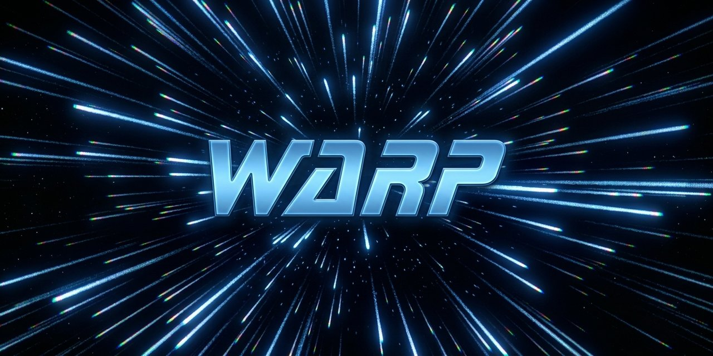

# 🖖 Warp: Go Boldly to Bed

A lightweight HTML5 and Web Audio API experiment that generates ambient warp-core engine noise and a starfield inspired by *Star Trek: The Next Generation*. 

Recreates the soothing low-frequency rumble of a Galaxy-class starship cruising through interstellar space to help you focus, relax, or drift off to sleep.



---

### [Go To Warp](https://m-spangenberg.github.io/warp/)

> [!NOTE] This ia a PWA app.
> **Mobile Friendly:** Works on desktop and mobile. For offline access you can install this as an app.

## Tests

Headless Chrome test suite in [`tests/`](tests/README.md).

```sh
cd tests
npm install   # once — installs puppeteer-core
npm test      # serves the repo root on :8377 and runs all suites
```

Screenshots are written to `.shots/` at the repo root. See `tests/README.md` for single-suite runs and environment variables.

---

*Live Long & Prosper.*